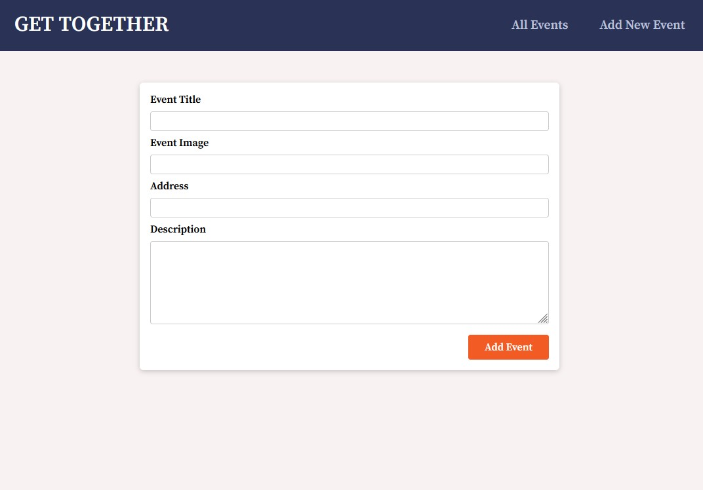

# Get Together Event Application with NextJS

## Description
Application let user add an event, see list of all the events and view event details.  MongoDB is used as the database to persist the data.

## About the project

This project was coded while following along the NextJS section of Academind's React the Complete Guide course (and it was long to get thought).

## What have I learnt from this project
- Intro to using the NextJS framework which provide tools to make a full-stack web app
- NextJS is suitable if SEO is a concern

## Screenshots

